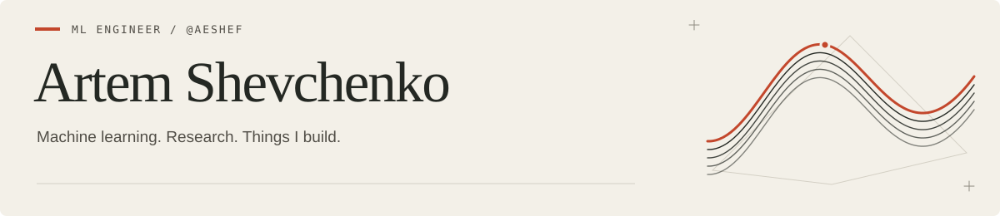

<picture>
  
</picture>

[Email](mailto:aeshevchenko1704@gmail.com) · [LinkedIn](https://www.linkedin.com/in/aeshef/) · [Telegram](https://t.me/plxlrd)

I'm an ML engineer at **Yandex Direct**. I work on browser agents, model evaluation, and the pipelines that get models into production. Before that, I worked on LLM evaluation and SFT data at Yandex Search.

I also teach **Machine Learning 2 at HSE** and mentor a **speculative decoding project at YSDA**. My research interests include 3D visual grounding at ITMO Robotics Lab and execution risk in quantitative finance.

## Selected work

<table>
<tr>
<td width="50%" valign="top">

### [obsidian-agent](https://github.com/aeshef/obsidian-agent)
**A Telegram inbox that works with your notes.**

Send text, voice, or photos; the assistant files them in Obsidian and uses tools to work with notes, tasks, and finances. Markdown and SQLite hold the data. Individual modules can be switched off across the UI, tools, and sync.

Python · RAG · tool calling · SQLite

[Demo & setup →](https://github.com/aeshef/obsidian-agent#readme)

</td>
<td width="50%" valign="top">

### [CEX–DEX arbitrage](https://github.com/aeshef/arbitrage-cex-dex)
**The execution side of an arbitrage trade.**

Code for my HSE bachelor's thesis: gas bidding with HJB, execution risk, and backtesting on Uniswap v3 ETH/USDC and Binance data. Includes an hourly pipeline and a separate trade-level analysis.

Python · stochastic control · market microstructure

[Research code →](https://github.com/aeshef/arbitrage-cex-dex#readme)

</td>
</tr>
<tr>
<td width="50%" valign="top">

### [bambu-pipe](https://github.com/aeshef/bambu-pipe)
**From a mesh to a print, in code.**

A Python pipeline for a Bambu Lab A1: validate a model, slice with OrcaSlicer, inspect a preview, then approve a print over LAN. CLI, Python API, and an optional text-to-3D provider.

Python · state machines · MQTT · FTPS

[Pipeline & examples →](https://github.com/aeshef/bambu-pipe#python-api)

</td>
<td width="50%" valign="top">

### [Finam AI Chat](https://github.com/aeshef/Finam-AI-Chat)
**Natural language to a trading API.**

Our prize-winning Finam × HSE hackathon project. Converts requests into API calls, with an endpoint registry, policy checks, and confirmation before write operations. Includes portfolio views and backtests.

Python · LLM orchestration · Streamlit · Docker

[Demos →](https://github.com/aeshef/Finam-AI-Chat#readme)

</td>
</tr>
</table>

**Also on my workbench:** [bRECs](https://github.com/aeshef/bRECs) — portfolio optimization and backtesting; [BusyBridge](https://github.com/aeshef/busybridge) — calendar availability sync without sharing event details; [GoodNotes-AI-Markup](https://github.com/aeshef/GoodNotes-AI-Markup) — handwriting data and OCR tooling.

<b>Tools, topics & background</b>

- **ML:** PyTorch, Transformers, Hugging Face, scikit-learn, XGBoost, LightGBM; NLP, computer vision, LLM evaluation, SFT, RAG, browser agents, speculative decoding.
- **Engineering:** Python, C++17, SQL, Linux, Bash, Docker, FastAPI, Airflow, MLflow, pandas, ClickHouse, PostgreSQL.
- **Quant:** cvxpy, QuantLib, PyPortfolioOpt, backtesting.py; Black–Litterman, risk parity, CVaR, Kelly, stochastic processes, market microstructure.
- **Background:** HSE, Yandex School of Data Analysis, CMF, Vega Fond. Research at ITMO Robotics Lab.
- **Other experiments:** [persona vectors / model steering](https://github.com/aeshef/preference-influencing).

---

Open to ML engineering and applied research roles. **UTC+3 · Remote / relocation.**
